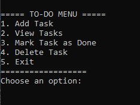

# 📝 ToDoList_Cpp

A simple console-based to-do list app built with C++ using a singly linked list.  
The app allows users to add tasks, remove them, and mark them as done.

 <!-- Replace with an actual screenshot when available -->

---

## ⚙️ How It’s Made

**Tech Used:** C++

This app uses a **singly linked list** to store and manage tasks.  
The user interacts with a numbered menu via a `while (true)` loop and a `switch` statement, with input mapped to an `enum class`.  
After each action, the console is cleared using `system("cls")` to keep the UI clean and avoid duplicated text output.

---

## 📚 Lessons Learned

This was my first time working with **C++**, and it was a great opportunity to dive into **pointers** and **linked lists**, both of which were new concepts for me.

Understanding how pointers work — especially how they reference memory and allow you to change the original value through indirection — was both interesting and powerful. It helped me see the benefits of pointers in scenarios where you need direct control over memory.

Coming from a **C#** background, the core syntax of C++ wasn’t too foreign, but I found the input/output system and pointer behavior to have a steep learning curve.  

This was also my first time creating a **console-only application** with no graphical interface, and it gave me a better appreciation for building logic-driven tools.

---

## 💡 Reflection

This project reminded me of the joy of figuring things out step by step — and how even simple tools like a text-based to-do list can teach you fundamental programming skills.

---